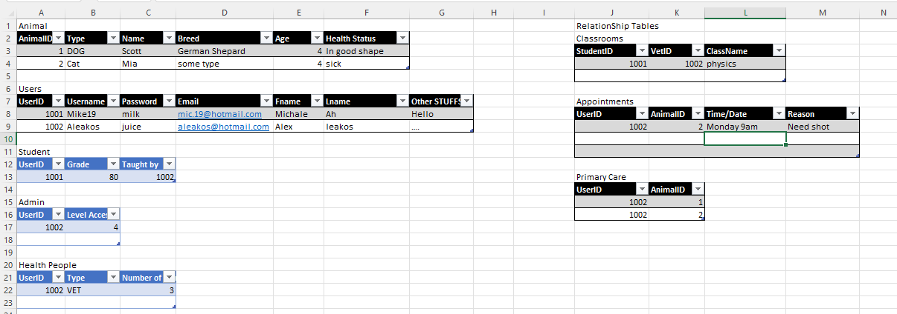

# Final-Project
607 final project

## Details & Links
* [Jira](https://uofceng607-196.atlassian.net/jira/software/projects/P196/boards/1)
* By Michael Ah-Kiow & Alexander Leakos
* [Github](https://github.com/Software-Engineering-Courses-Moshirpour/final-project-uofeng607-196/tree/main) 
## How to to run:
1. Download and run the Schema.sql attached in the Main Branch
2. Open the Maven Project (Folder is DB) and click on "existing projects" in maven.
3. Ensure that the SQL database is active and running.
4. Start the program.

Small note:  We used Spring boot and integrated our backend api with a mysql database as mock data.

## Stories Covered:
* 
## Examples of a working backend with the API:

1. Illustration of our mocktables (that was loaded into the mysql database)

## Commands to Run From Command Line:

While in `final-project-uofeng607-196`:
- navigate down one level into db `cd db`
- build maven project with `mvn install`
- run projet with `mvn exec:java -Dexec.mainClass=com.p196.db.DbApplication`

## Video
![Link]https://www.loom.com/share/5ad8564c427048c18e7cd98c4f832f3a

